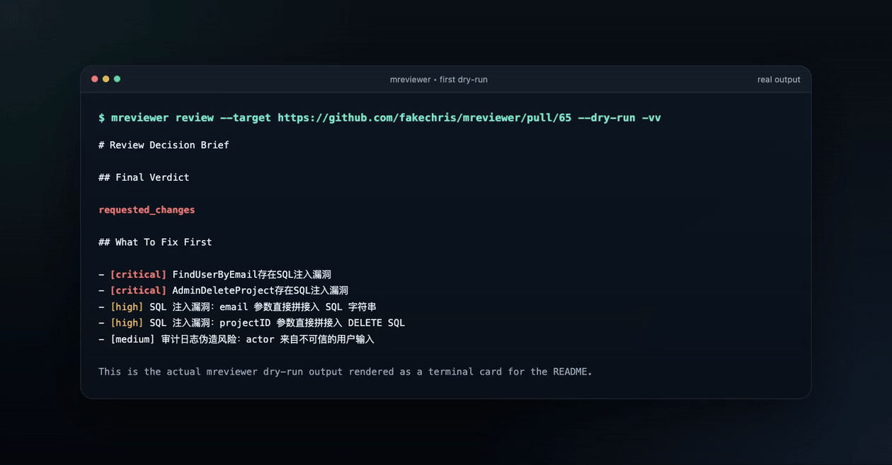
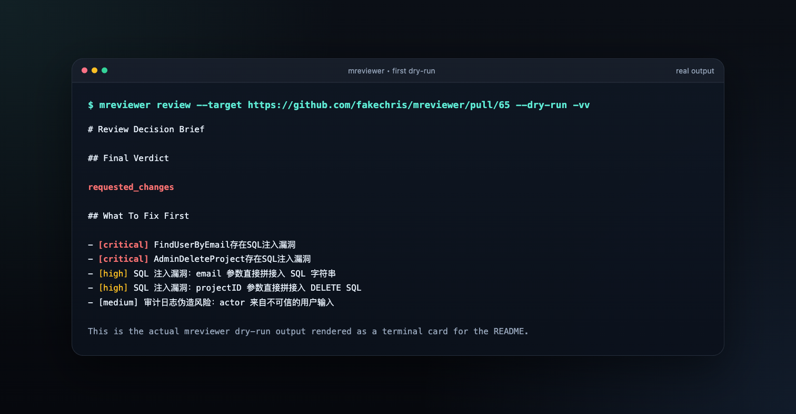
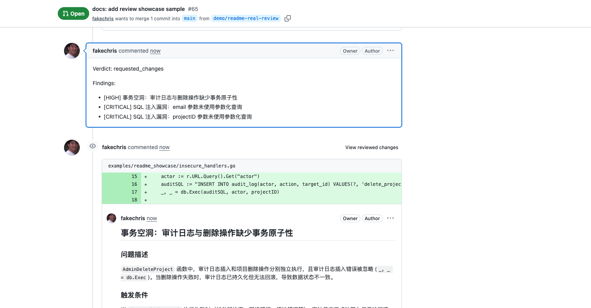
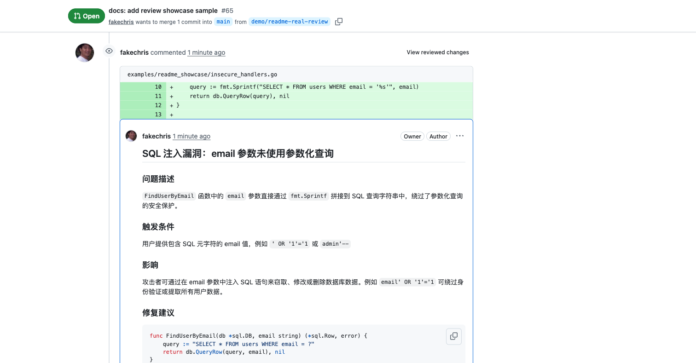

# mreviewer

[](https://hub.docker.com/u/fakechris)

[中文文档](./README.zh-CN.md) | English

Multi-model AI code review for GitHub pull requests and GitLab merge requests.

`mreviewer` is built for a very simple first experience: install one binary, point it at a real PR, and get back something you can act on.

If you are trying it for the first time, start with the Personal CLI path. The goal is not to stand up infrastructure. The goal is to get one useful review in about five minutes.

## What Your First Result Actually Is

`mreviewer` does not just dump model output. A first run gives you three layers:

- a short verdict such as `approved` or `requested_changes`
- a short `What To Fix First` list so you know where to start
- inline comments on the exact changed lines when you publish back to GitHub

If your first run says `requested_changes`, that is not a setup failure. It means the tool found something concrete enough to block on.



The same review, broken out:

| CLI dry-run | GitHub brief |
| --- | --- |
|  |  |

| GitHub inline finding |
| --- |
|  |

What you are looking at:

- The CLI dry-run is the safest first step. It shows the verdict and the top findings before anything is posted back.
- The GitHub brief is the PR-level answer: should this merge as-is, or does it need work first?
- The inline comments are the useful part when you are actually fixing the PR. They point at the changed lines and explain why they matter.

## Start Here

- **Personal CLI**: one binary, local SQLite, no Docker. Best for your first run.
- **Enterprise Webhook**: automatic webhook review, history, queueing, and `/admin/`.

## Get Your First Review In 5 Minutes

### 1. Install `mreviewer`

Recommended:

```bash
curl -fsSL https://raw.githubusercontent.com/fakechris/mreviewer/main/scripts/install.sh | bash
```

Homebrew is also supported:

```bash
brew tap fakechris/mreviewer https://github.com/fakechris/mreviewer
brew install mreviewer
```

Verify the binary:

```bash
mreviewer version
```

### 2. Generate a personal config template

```bash
mreviewer init --provider openai
```

This writes `config.yaml`, creates `.mreviewer/state/`, and defaults to local SQLite. You do not need to hand-edit YAML to get started.

The generated OpenAI route defaults to `output_mode: tool_call`. `json_schema` is still available, but `tool_call` is the more robust default across OpenAI-compatible providers because the runtime already does local strict validation and one repair pass.

If you want to start with Zhipu GLM-5 instead of OpenAI:

```bash
mreviewer init --provider zhipuai
```

For Zhipu `GLM-5` / `GLM-5.1`, prefer `tool_call` routes. A live probe on 2026-04-10 showed intermittent `429/code=1305` congestion and non-schema responses under `json_schema strict=true`, so strict JSON-schema mode should not be treated as the primary production path on this endpoint (see [the acceptance probe](docs/acceptance/2026-04-10-zhipu-glm51-structured-output-probe.md)).

If you want to preview the generated config without writing files:

```bash
mreviewer init --provider openai --dry-run
```

### 3. Export the minimum credentials

```bash
export OPENAI_API_KEY=...
export GITHUB_TOKEN=...
```

For Zhipu GLM-5, export `ZHIPUAI_API_KEY` instead of `OPENAI_API_KEY`:

```bash
export ZHIPUAI_API_KEY=...
export GITHUB_TOKEN=...
```

GitLab is optional for the first run. Add it later if you want to review GitLab MRs too:

```bash
export GITLAB_BASE_URL=https://gitlab.example.com
export GITLAB_TOKEN=...
```

### 4. Check the setup before spending tokens

```bash
mreviewer doctor --json
```

This validates config, database, model routing, and platform credentials up front.

### 5. Preview the run before writing anything back

```bash
mreviewer review \
  --target https://github.com/acme/repo/pull/17 \
  --dry-run \
  --output both \
  --reviewer-packs security,architecture,database \
  -vv
```

This is the safest first experience. You see the verdict, the shortlist, and the exact packs that fired, but nothing is written back yet.

### 6. Run the real review

```bash
mreviewer review \
  --target https://github.com/acme/repo/pull/17 \
  --output both \
  --reviewer-packs security,architecture,database
```

By default, this posts the review back to the PR. If you only want local artifacts, add `--publish artifact-only`.

What you get from a real run:

- a brief verdict you can scan in seconds
- a small list of the highest-priority findings
- inline comments for the changed lines that actually need work
- JSON output you can feed into scripts or other agents

### 7. Optional: run local webhooks and admin UI

```bash
mreviewer serve
```

By default this starts:
- local SQLite at `.mreviewer/state/mreviewer.db`
- GitLab webhook: `POST /webhook`
- GitHub webhook: `POST /github/webhook`
- local admin page: `/admin/`

Use `mreviewer serve --db file:/custom/path.db` to override the local database path.

If you only want to validate the runtime plan:

```bash
mreviewer serve --dry-run -vv
```

## Personal CLI At A Glance

- `mreviewer init`: generate a personal config template
- `mreviewer doctor`: validate config, database, provider routes, and platform tokens
- `mreviewer review`: review one GitHub/GitLab target
- `mreviewer serve`: run ingress + worker in one local process with embedded migrations
- `mreviewer help`: show grouped top-level or subcommand help
- `mreviewer version`: show the installed CLI version

Backward compatibility remains: `mreviewer --target ...` still works and maps to `review`.

## Common First-Time Commands

```bash
# install
curl -fsSL https://raw.githubusercontent.com/fakechris/mreviewer/main/scripts/install.sh | bash

# generate config
mreviewer init --provider openai

# or use Zhipu GLM-5
mreviewer init --provider zhipuai

# Zhipu recommendation: keep output_mode=tool_call
# strict json_schema is not yet reliable on this endpoint

# validate setup
mreviewer doctor

# preview without side effects
mreviewer review --target <pr-or-mr-url> --dry-run -vv

# run for real
mreviewer review --target <pr-or-mr-url> --output both --publish artifact-only
```

## CLI Behavior And Output

Key flags:

- `--target`: GitHub PR or GitLab MR URL
- `--targets`: comma-separated GitHub/GitLab PR or MR URLs for multi-target review and aggregate comparison
- `--output`: `markdown`, `json`, or `both`
- `--dry-run` / `--dryrun`: render the execution plan and output without publish or status side effects
- `--verbose`, `-v`, `-vv`, `-vvv`, `-vvvv`: increase trace detail
- `--publish`: `full-review-comments`, `summary-only`, or `artifact-only`
- `--reviewer-packs`: comma-separated reviewer packs
- `--route`: model or model-chain override
- `--advisor-route`: optional stronger second-opinion model or chain override
- `--exit-mode`: `never` or `requested_changes`; returns exit code `3` when the final verdict requests changes
- `--compare-live`: comma-separated reviewer IDs/kinds already present on the target PR/MR, for example `reviewer-a,reviewer-b`
- `--compare-artifacts`: comma-separated JSON artifact paths to compare against the current review bundle

JSON output includes:
- `review_brief`
- `judge_verdict`
- `decision_benchmark`
- `comparison`
- `aggregate_comparison`
- `advisor_artifact`

Markdown output starts with `# Review Decision Brief` and surfaces:
- `Final Verdict`
- `What To Fix First`
- `Specialist Signals`
- `Reviewer Overlap` when comparison is enabled

Runtime environment overrides:

- `REVIEW_PACKS`: default reviewer packs for CLI/runtime processing
- `REVIEW_MODEL_CHAIN`: default review chain reference
- `REVIEW_ADVISOR_CHAIN`: default stronger second-opinion chain reference
- `REVIEW_COMPARE_REVIEWERS`: comma-separated external reviewer IDs to compare during runtime processing

## When To Use Enterprise Webhook

Use the enterprise path when you need:
- automatic GitLab/GitHub webhook reviews
- MySQL-backed queueing and history
- separate `ingress` and `worker` services
- operator actions and dashboard visibility

## Enterprise Webhook Quick Start

```bash
cp .env.example .env
docker compose up -d --build
```

For image-based deployment:

```bash
docker compose -f docker-compose.prod.yaml up -d
```

For custom routes or mounted config:

```bash
docker compose -f docker-compose.prod.yaml -f docker-compose.prod.config.yaml up -d
```

`docker-compose.yaml` is for local developer source builds. `docker-compose.prod.yaml` is for enterprise-style deployment. MySQL is the recommended enterprise default; SQLite remains fine for local single-machine usage.

### Configure GitLab Webhook

1. Go to GitLab project → Settings → Webhooks
2. URL: `http://your-server:3100/webhook`
   - For local-network testing, replace `your-server` with your machine's LAN IP, for example `http://10.0.0.16:3100/webhook`
   - Do not use `localhost` unless GitLab and mreviewer are running on the same host
3. Secret: value from `GITLAB_WEBHOOK_SECRET`
4. Trigger: check `Merge request events`
5. Click `Add webhook`

If GitLab rejects the hook with `Invalid url given`, ask a GitLab admin to enable `Allow requests to the local network from web hooks and services`, or use a public HTTPS tunnel instead of a LAN IP.

GitHub webhook path is `POST /github/webhook` and follows the same ingress/worker control plane.

📖 Detailed setup: [WEBHOOK.md](./WEBHOOK.md)

## Admin Control Plane

Enterprise and local `serve` mode both expose `/admin/`.

Key API routes:

- `/admin/api/queue`
- `/admin/api/concurrency`
- `/admin/api/failures`
- `/admin/api/runs`
- `/admin/api/trends`
- `/admin/api/ownership`
- `/admin/api/identities`

Set `MREVIEWER_ADMIN_TOKEN` or `ADMIN_TOKEN` to require `Authorization: Bearer <token>` on the admin routes.

## Manual Trigger (Enterprise Optional)

Trigger a GitLab review without waiting for webhook delivery:

```bash
docker compose exec worker /app/manual-trigger \
  --project-id 123 \
  --mr-iid 456 \
  --wait
```

The worker image also includes `/app/mreviewer` for direct CLI review.

## Architecture

```
GitLab → ingress (webhook) → MySQL/SQLite
                           ↓
                        worker → LLM Provider
                           ↓
                    GitLab (discussions)
```

## Technical Documentation

- [GitLab Webhook Setup](./WEBHOOK.md) - Three configuration methods (project/group/system)
- [Docker Deployment](./DEPLOYMENT.md) - Build and deploy to production
- [Enterprise Webhook Architecture](./docs/architecture/enterprise-webhook.md) - Queue semantics, concurrency model, and control-plane design
- [Admin Dashboard Operations](./docs/operations/admin-dashboard.md) - `/admin/` usage and bearer auth
- [Failure Playbook](./docs/operations/failure-playbook.md) - How to triage provider, worker, and supersede failures
- [Contributing Guide](./CONTRIBUTING.md) - How to contribute
- [Configuration](./config.yaml) - Safe default runtime config
- [Advanced Configuration Template](./config.example.yaml) - Multi-provider example with env expansion

## Roadmap

See [TODOS.md](./TODOS.md) for current priorities.

## License

MIT License - see [LICENSE](./LICENSE)
