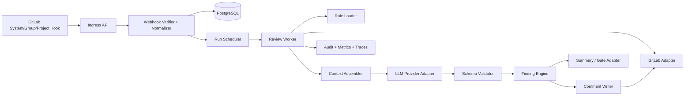

# Design 0001: GitLab MR Review System

状态：Draft
日期：2026-03-16

## 1. 设计结论

推荐采用 **纯 webhook service 架构** 作为主实现，核心目标是把“事件接入、LLM 分析、finding 生命周期、GitLab 原生回写”做成一个平台能力，而非每个仓库各自维护的 CI 脚本。

## 2. 高层架构



## 3. 部署拓扑

### 3.1 MVP

- `ingress` x 2（无状态）
- `worker` x 2
- PostgreSQL 16
- Redis 7（可选；MVP 可用 PG outbox）
- 对象存储（可选）

### 3.2 推荐容器拆分

- `api-ingress`
- `run-scheduler`
- `review-worker`
- `comment-writer`（可先并入 worker）
- `db-migrator`

## 4. 数据流

### 4.1 事件接入与归一化

1. GitLab 发出 System / Group / Project webhook。
2. `Ingress API` 验证：
   - `X-Gitlab-Token`
   - 来源 IP allowlist（可选）
   - delivery 去重
3. `Normalizer` 提取：
   - project id / path
   - MR iid / internal id
   - action
   - oldrev
   - source/target branch
   - user
   - head_sha（若 payload 不可靠则延后查询）
4. 记录 `hook_events`。
5. 生成 `review_runs` 或标记已有幂等 run。

### 4.2 review run 执行

1. 读取 project/group/platform policy。
2. 拉取 MR 详情、MR versions、最新 diff。
3. 如果 diff 尚未就绪，按指数退避重试。
4. 过滤：
   - generated / too_large / binary / vendor / lock
   - path exclude
5. 读取 `REVIEW.md` 和其他允许的规则文件。
6. 构造 `ReviewRequest`。
7. 调用 LLM provider。
8. 校验 `ReviewResult` schema。
9. 进入 finding engine 做 fingerprint / dedupe / state transition。
10. 调 comment writer 回写 discussions。
11. 更新 run summary / audit / metrics。

## 5. 上下文组装策略

### 5.1 MVP 上下文原则

默认只发：

- 变更 hunk
- hunk 前后各 N 行上下文
- 必要时同文件局部片段
- 根目录 `REVIEW.md`
- 历史 active bot findings 摘要

不默认发：

- 整仓库代码
- 二进制 / 大文件
- 第三方 vendor
- 生成文件

### 5.2 未来增强

- 语义检索补充相关定义/调用方
- `refs/merge-requests/:iid/head` shallow fetch
- linked repositories

## 6. 规则系统设计

### 6.1 配置层级

优先级从低到高：

1. Platform defaults
2. Group policy
3. Project policy
4. Repo `.gitlab/ai-review.yaml`
5. Root `REVIEW.md`
6. Nearest path `REVIEW.md`
7. Manual rerun overrides

### 6.2 `REVIEW.md` 规范建议

用于自然语言规则，不做复杂 machine fields。建议结构：

```md
# Review Guidelines

## Always check
- 新 API endpoint 必须有 integration test
- 数据库 migration 必须向后兼容

## Focus areas
- 错误处理
- 并发与锁
- 权限校验

## Ignore
- src/gen/**
- *.lock

## Project-specific invariants
- PaymentAttempt.status 只能单向流转
```

### 6.3 `.gitlab/ai-review.yaml` 规范建议

```yaml
version: 1
review:
  enabled: true
  max_files: 80
  max_changed_lines: 2500
  confidence_threshold: 0.78
  severity_threshold: medium
  include_paths:
    - "src/**"
  exclude_paths:
    - "**/*.lock"
    - "vendor/**"
    - "generated/**"
  context:
    mode: hunk_plus_local
    lines_before: 20
    lines_after: 20
  gate:
    mode: threads_resolved
  providers:
    primary: openai
```

## 7. LLM 输出 schema

### 7.1 设计原则

- 主 schema 由系统定义，而不是迁就任一 provider。
- findings 是 typed objects，不接受自由格式文本。
- 模型输出只负责“发现与证据表达”，不负责 GitLab API 参数细节。

### 7.2 建议 schema（逻辑视图）

```json
{
  "schema_version": "1.0",
  "run_summary": {
    "overall_risk": "medium",
    "summary_markdown": "Found 2 likely bugs worth fixing before merge."
  },
  "findings": [
    {
      "category": "correctness",
      "severity": "high",
      "confidence": 0.91,
      "title": "Nil check missing before dereference",
      "body_markdown": "When `user.profile` is null this path panics...",
      "path": "src/auth/session.ts",
      "anchor": {
        "kind": "line",
        "new_line": 87,
        "old_line": null,
        "snippet": "const timezone = user.profile.timezone"
      },
      "evidence": [
        "`user.profile` is optional in `User` type",
        "no guard exists in this branch"
      ],
      "suggested_patch": {
        "language": "diff",
        "content": "@@ ..."
      },
      "rule_refs": ["REVIEW.md:Always check#error-handling"],
      "canonical_key": "missing-null-guard:user.profile"
    }
  ]
}
```

### 7.3 Schema 校验与解析兜底

- 首选 provider 原生 structured output / JSON schema。
- 校验失败时进入 parser fallback：
  1. marker extraction
  2. tolerant JSON repair
  3. 若仍失败，run 标记 `parser_error`
- `parser_error` 不得写出半损坏 inline discussions。

## 8. Finding engine 设计

### 8.1 双 fingerprint

#### anchor_fingerprint

用于“同一位置、同类问题”的强去重：

`hash(normalized_path + anchor_kind + normalized_snippet + category + canonical_key)`

#### semantic_fingerprint

用于“同一问题但位置漂移”的弱匹配：

`hash(normalized_path + category + canonical_key + symbol_or_scope)`

### 8.2 状态机

```text
new -> posted -> active -> fixed
                   \-> superseded
                   \-> stale
                   \-> ignored
```

### 8.3 匹配逻辑

1. 同一 HEAD、同一 anchor_fingerprint：直接 dedupe。
2. 新 HEAD、同一 anchor_fingerprint：更新 `last_seen_run_id`，不重发。
3. 新 HEAD、anchor 不同但 semantic_fingerprint 相同：尝试重定位。
4. 无法重定位：新建 thread，旧 thread resolve 为 superseded。
5. 新 run 未再出现的 active finding：转 `fixed` 或 `stale`。

## 9. GitLab 评论写回策略

### 9.1 主通道：diff discussion

写入前步骤：

1. 读取最新 MR version 的 `base/start/head`。
2. 依据当前 diff hunk 校验 path / line。
3. 构建 `position`：
   - `position_type=text`
   - `old_path/new_path`
   - `old_line/new_line` 或 `line_range`
4. 创建 discussion。

### 9.2 次级通道：file-level discussion

使用场景：

- 可确认文件，但无法安全确认具体行。
- 设计层面的文件问题。
- diff 过大或 hunk 已坍塌。

### 9.3 最后兜底：general note

用于：

- parser_error
- run summary
- 无法定位的跨文件问题

### 9.4 comment body 模板

建议每条 finding 评论包含：

- `title`
- 1 段具体问题说明
- 1 段“为何这是 bug / 风险”
- 可选“建议修复方向”
- 系统 metadata 折叠块（fingerprint / confidence / finding id）

示例：

```md
**Possible null dereference before timezone access**

`user.profile` is optional in the current type flow, but this branch dereferences it unconditionally. If a user without a profile reaches this path, the request will throw before the fallback logic runs.

Suggested direction: guard `user.profile` before reading `timezone`, or fall back to the default timezone.

<!-- ai-review:finding_id=fr_123 anchor_fp=... semantic_fp=... confidence=0.91 -->
```

### 9.5 suggestions 策略

MVP：

- 默认关闭自动 suggestion。
- 仅当模型输出 patch 置信度很高，且 patch 长度、格式、目标行都满足约束时启用。

原因：

- AI review 与 AI autofix 是两类风险模型。
- suggestion 一旦被“Apply”，GitLab 会创建 commit，不宜在 MVP 大范围开启。

## 10. 重试与幂等设计

### 10.1 幂等键

- `hook_event_idempotency_key`
- `review_run_idempotency_key`
- `comment_action_idempotency_key`

### 10.2 重试策略

- GitLab API 429/5xx：指数退避 + 抖动
- provider timeout：有限次数重试
- diff not ready：短间隔多次重试
- parser failure：不自动重试 provider，直接进入失败路径

### 10.3 Outbox

推荐以 Postgres transaction + outbox 模式记录：

- `review_run_created`
- `findings_ready`
- `comment_post_requested`
- `discussion_resolve_requested`

这样可以把数据库状态和异步执行保持一致。

## 11. Merge gate 设计

### 11.1 默认 gate

- 让 bot 发 resolvable diff discussions
- 项目启用 `All threads must be resolved`

优点：

- 所有 tier 通用
- 开发者认知自然
- 与每个 finding 一一对应

### 11.2 可选 gate：external status checks

建议只作为补充：

- 快速预检结果
- run-level pass/fail summary
- Ultimate 环境下的额外 widget

不建议作为深度 LLM review 的唯一 gate，因为 pending timeout 短。

### 11.3 CI 架构中的 gate

若组织选择 B 架构，则直接用 pipeline job 状态做 gate，并把 inline threads 作为解释层。

## 12. 安全设计

### 12.1 默认安全原则

- 只读 GitLab 内容，不执行仓库代码
- 默认最小代码外发
- 规则文件 allowlist
- provider 与 token 分离
- 按项目分类决定 provider route

### 12.2 Prompt 注入防护

- 仓库内容标记为 untrusted context
- 不允许模型因为代码注释或 README 改变系统策略
- `REVIEW.md` / `.gitlab/ai-review.yaml` 只有在 allowlist 命中时才算 trusted instructions

## 13. 可观测性

### 13.1 指标

- webhook_received_total
- webhook_deduped_total
- review_run_started_total
- review_run_completed_total
- review_run_failed_total
- finding_posted_total
- finding_deduped_total
- finding_resolved_total
- parser_error_total
- provider_latency_ms
- provider_tokens_total
- comment_writer_latency_ms

### 13.2 Trace span

- webhook.verify
- gitlab.fetch_mr
- gitlab.fetch_versions
- gitlab.fetch_diffs
- rules.load
- llm.request
- parser.validate
- dedupe.match
- gitlab.create_discussion

### 13.3 审计日志

至少记录：

- 谁/什么事件触发了 run
- 用了哪个 provider/model
- 发了哪些 discussions
- 哪些 discussions 被 resolve / supersede
- 配置来源与命中规则文件

## 14. 推荐目录结构

```text
repo/
  cmd/
    ingress/
    worker/
    replayer/
    migrate/
  internal/
    app/
    config/
    gitlab/
    hooks/
    scheduler/
    rules/
    context/
    llm/
    findings/
    writer/
    gate/
    audit/
    metrics/
    db/
  migrations/
  api/
    openapi/
    schemas/
  deploy/
    helm/
    kustomize/
  examples/
    REVIEW.md
    ai-review.yaml
  docs/
```

## 15. 关键接口定义

### 15.1 Go 风格接口建议

```go
type EventNormalizer interface {
    Normalize(raw []byte, headers map[string]string) (*NormalizedWebhookEvent, error)
}

type GitLabClient interface {
    GetMergeRequest(ctx context.Context, projectID int64, mrIID int64) (*MergeRequest, error)
    GetMergeRequestVersions(ctx context.Context, projectID int64, mrIID int64) ([]MRVersion, error)
    GetMergeRequestDiffs(ctx context.Context, projectID int64, mrIID int64) ([]DiffFile, error)
    ListDiscussions(ctx context.Context, projectID int64, mrIID int64) ([]Discussion, error)
    CreateDiscussion(ctx context.Context, req CreateDiscussionRequest) (*Discussion, error)
    ResolveDiscussion(ctx context.Context, req ResolveDiscussionRequest) error
}

type RuleLoader interface {
    Load(ctx context.Context, project ProjectRef, changedPaths []string) (*EffectiveRules, error)
}

type ReviewProvider interface {
    Analyze(ctx context.Context, req *ReviewRequest) (*ReviewResult, error)
}

type FindingMatcher interface {
    Match(ctx context.Context, run *ReviewRun, findings []Finding) ([]FindingDecision, error)
}

type CommentWriter interface {
    Write(ctx context.Context, decisions []FindingDecision) error
}
```

## 16. 数据库表草案

### 16.1 核心表

#### `gitlab_instances`
- `id`
- `name`
- `base_url`
- `auth_mode`
- `created_at`

#### `projects`
- `id`
- `gitlab_instance_id`
- `gitlab_project_id`
- `full_path`
- `namespace_path`
- `default_branch`
- `state`
- `created_at`
- `updated_at`

#### `project_policies`
- `id`
- `project_id`
- `enabled`
- `provider_key`
- `confidence_threshold`
- `severity_threshold`
- `gate_mode`
- `config_json`
- `updated_at`

#### `hook_events`
- `id`
- `gitlab_instance_id`
- `source_type`
- `delivery_key`
- `project_id`
- `mr_iid`
- `head_sha`
- `event_action`
- `payload_json`
- `status`
- `created_at`

#### `merge_requests`
- `id`
- `project_id`
- `gitlab_mr_iid`
- `gitlab_mr_id`
- `source_branch`
- `target_branch`
- `author_id`
- `state`
- `last_seen_head_sha`
- `updated_at`

#### `mr_versions`
- `id`
- `merge_request_id`
- `gitlab_version_id`
- `base_sha`
- `start_sha`
- `head_sha`
- `patch_id_sha`
- `created_at`

#### `review_runs`
- `id`
- `merge_request_id`
- `mr_version_id`
- `trigger_type`
- `idempotency_key`
- `status`
- `provider_key`
- `model_name`
- `rules_digest`
- `started_at`
- `finished_at`
- `error_code`
- `error_message`

#### `review_findings`
- `id`
- `review_run_id`
- `category`
- `severity`
- `confidence`
- `title`
- `body_markdown`
- `path`
- `anchor_kind`
- `old_line`
- `new_line`
- `anchor_snippet`
- `anchor_fingerprint`
- `semantic_fingerprint`
- `canonical_key`
- `state`
- `matched_finding_id`
- `discussion_id`
- `created_at`
- `updated_at`

#### `gitlab_discussions`
- `id`
- `merge_request_id`
- `gitlab_discussion_id`
- `gitlab_note_id`
- `finding_id`
- `position_json`
- `resolved`
- `resolved_at`
- `superseded_by_discussion_id`
- `created_at`

#### `comment_actions`
- `id`
- `finding_id`
- `action_type`
- `idempotency_key`
- `request_json`
- `response_json`
- `status`
- `created_at`

#### `audit_logs`
- `id`
- `actor_type`
- `actor_ref`
- `event_type`
- `entity_type`
- `entity_id`
- `payload_json`
- `created_at`

## 17. 最小可用技术选型建议

### 17.1 后端语言

推荐 **Go**：

- 单二进制部署友好
- 并发与 I/O 密集场景合适
- 易于做长生命周期服务
- 在企业内 self-hosted 运维成本低

备选：TypeScript/NestJS。若组织已有 TS 平台团队，也可以接受。

### 17.2 基础设施

- PostgreSQL 16
- Redis 7（或 PG outbox）
- S3 兼容对象存储（可选）
- OpenTelemetry + Prometheus + Grafana
- Loki / ELK

### 17.3 Provider SDK

- OpenAI Responses / structured outputs
- Anthropic Messages / provider-specific CLI or API wrapper
- Azure OpenAI
- Bedrock
- Vertex AI

### 17.4 为什么推荐 Go + Webhook Service，而不是直接 fork reviewer 项目

- 系统核心是 durable state machine，而不是脚本。
- 需要强 API client、comment writer、重试、幂等、表结构和运维可控性。
- 未来要接多 provider、多 output adapters、多配置层，独立工程骨架比 fork PoC 更稳。
